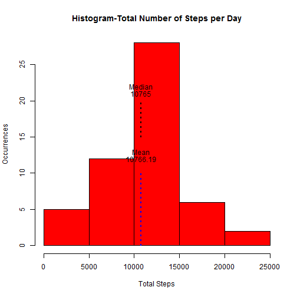
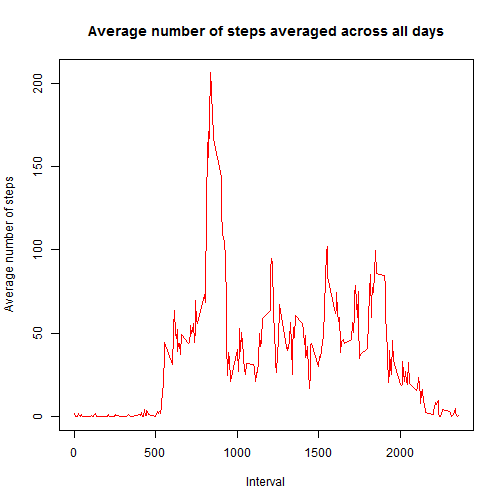
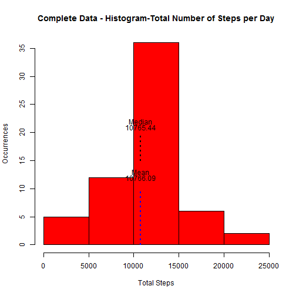
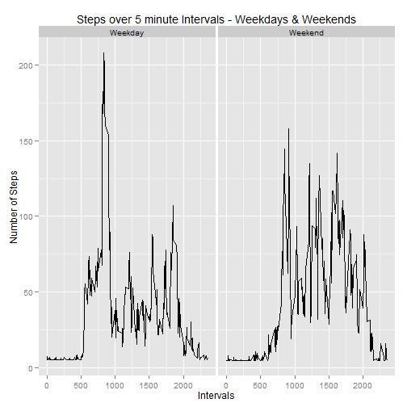

# Data Science Course: Reproducible Research
### Peer Assessment 1

## Introduction
This assignment makes use of data from a personal activity monitoring device. This device collects data at 5 minute intervals through out the day. The data consists of two months of data from an anonymous individual collected during the *months of October and November, 2012 and include the number of steps taken in 5 minute intervals each day*.

## Data Setup
### Details of the data
The data for this assignment can be downloaded from the [course web site](https://www.coursera.org/course/repdata):

**Dataset**: [Activity monitoring data](http://d396qusza40orc.cloudfront.net/repdata%2Fdata%2Factivity.zip)

The dataset is stored in a comma-separated-value (CSV) file and there are a total of 17,568 observations in this dataset.

The variables included in this dataset are:

-  **steps**   : Number of steps taking in a 5-minute interval (missing values are coded as NA)
-  **date**    : The date on which the measurement was taken in YYYY-MM-DD format
-  **interval**: Identifier for the 5-minute interval in which measurement was taken
  

### Download the data
This section of code will **setup the target directory and download and unzip** the activity data from the website. 

  1. Create the target directory if not present
  2. Download the file as activity.zip under the directory
  3. Unzip the zip file


```r
source_url = "http://d396qusza40orc.cloudfront.net/repdata%2Fdata%2Factivity.zip"
zipFname <- "repdata-data-activity.zip"
rootWorkDir <- "c:/repdata"
fName <- "c:/repdata/activity.csv"
# Create the Target working Directory

if (!file.exists(rootWorkDir)) {
    dir.create(file.path(rootWorkDir))
    setwd(file.path(rootWorkDir))
} else {
    setwd(file.path(rootWorkDir))
}
setwd(file.path(rootWorkDir))


# Download the file and set the file path
if (!file.exists(zipFname)) {
    download.file(source_url, destfile = zipFname)
    unzip(zipFname, exdir = ".")
}
```

### Load and process the data
After the download, the data will be read from the activity.csv file


```r
# Read the data
if (file.exists(fName)) {
    fullDataSet <- read.csv(fName, as.is = TRUE)
}
```


### Attach add-on packages
Load and attach the package [ggpot2](http://cran.r-project.org/web/packages/ggplot2/ggplot2.pdf) to create plots.

```r
library(ggplot2)
```

## Assignment

### 1.What is mean total number of steps taken per day
Missing values are ignored for this part of the assignment. This code creates a **histogram** of total number of steps per day, **calculate and report** the **Mean** and **Median** total number of steps taken per day.

#### Histogram 

```r
# total number of steps in a day
steps_per_day <- aggregate(steps ~ date, fullDataSet, sum, na.rm = TRUE)
# total mean and median steps
mean_steps <- mean(steps_per_day$steps)
median_steps <- median(steps_per_day$steps)
# create histogram
hist(steps_per_day$steps, col = "red", main = "Histogram-Total Number of Steps per Day", 
    xlab = "Total Steps", ylab = "Occurrences")
# report mean value in histogram
lines(c(mean_steps, mean_steps), c(0, 10), col = "blue", lwd = 2, lty = 3)
text(mean_steps, 12, round(mean_steps, 2))
text(mean_steps, 13, "Mean")

# report median value in histogram
lines(c(median_steps, median_steps), c(15, 20), col = "black", lwd = 2, lty = 3)
text(median_steps, 21, round(median_steps, 2))
text(median_steps, 22, "Median")
```

 

#### Report: Mean and Median total number of steps taken per day

```r
# print mean and median
cat(c(" Mean   :", round(mean_steps, 2)), "\n", c("Median :", round(median_steps, 
    2)), "\n")
```

```
##  Mean   : 10766.19 
##  Median : 10765
```

### 2.What is the average daily activity pattern?
Creation of **time series plot** (i.e. type = "l") of the 5-minute interval (x-axis) and the average number of steps taken, averaged across all days (y-axis). Observe, **Which 5-minute interval, on average across all the days in the dataset, contains the maximum number of steps**? For this calculation, the missing values are ignored.

#### Time Series Plot

```r
# average interval steps
interval_avrg_steps <- aggregate(steps ~ interval, fullDataSet, mean, na.rm = TRUE)
# generate the time series plot
plot(interval_avrg_steps$interval, interval_avrg_steps$steps, type = "l", col = "Red", 
    main = "Average number of steps averaged across all days", xlab = "Interval", 
    ylab = "Average number of steps")
```

 


#### Observation

```r
max_interval_avrg_steps <- interval_avrg_steps[which.max(interval_avrg_steps$steps), 
    ]

# print the interval that has max average number of steps
cat("The interval ", max_interval_avrg_steps$interval, " contains ", round(max_interval_avrg_steps$steps, 
    2), " as the maximum average number of steps.", "\n")
```

```
## The interval  835  contains  206.2  as the maximum average number of steps.
```


### 3.Imputing missing values
The dataset contains missing values and it was observed using **summary(fullDataSet)** that there are missing values (code as NA) and this may introduce bias into some calucations or summaries of the data.  In order to address this issue, this part of code will identify the number of missing values and device and implement a strategy to replace with a value.

Using this new completed data set, a **histogram** of the total number of steps taken each day and Calculate will be created and report the **mean and median** total number of steps taken per day.

Observation: 
- Do these values differ from the estimates from the first part of the assignment that ignored the missed values? 
- What is the impact of imputing missing data on the estimates of the total daily number of steps?


#### Total Number of rows with 'NA's 

```r
na_data <- fullDataSet[!complete.cases(fullDataSet), ]
paste("Total number of rows with NAs is", nrow(na_data))
```

```
## [1] "Total number of rows with NAs is 2304"
```

#### Strategy to fill missing values
The strategy to fill the missing value is *first to calculate the **mean** of the steps from the original data* set and create a **new data** set by replacing the missed value (NA) with the calculated mean value.

#### New data set with missing data filled

```r
new_complete_data <- fullDataSet
complete_case_data <- na.omit(fullDataSet)
complete_case_mean_steps <- round(mean(complete_case_data$steps), 2)

for (i in 1:nrow(new_complete_data)) {
    if (is.na(new_complete_data$steps[i])) {
        new_complete_data$steps[i] <- complete_case_mean_steps
        
    }
}
```

#### Histogram


```r
# total number of steps in a day
steps_per_day <- aggregate(steps ~ date, new_complete_data, sum, na.rm = TRUE)
# total mean and median steps
mean_imp_steps <- mean(steps_per_day$steps)
median_imp_steps <- median(steps_per_day$steps)
# create histogram
hist(steps_per_day$steps, col = "red", main = "Complete Data - Histogram-Total Number of Steps per Day", 
    xlab = "Total Steps", ylab = "Occurrences")
# report mean value in histogram
lines(c(mean_imp_steps, mean_imp_steps), c(0, 10), col = "blue", lwd = 2, lty = 3)
text(mean_imp_steps, 12, round(mean_imp_steps, 2))
text(mean_imp_steps, 13, "Mean")

# report median value in histogram
lines(c(median_imp_steps, median_imp_steps), c(15, 20), col = "black", lwd = 2, 
    lty = 3)
text(median_imp_steps, 21, round(median_imp_steps, 2))
text(median_imp_steps, 22, "Median")
```

 

#### Report

```r
# print mean and median
cat("Before Imputing:", "\n", c(" Mean   :", round(mean_steps, 2)), "\n", c(" Median :", 
    round(median_steps, 2)), "\n", "\n", "After Imputing:", "\n", c(" Mean   :", 
    round(mean_imp_steps, 2)), "\n", c(" Median :", round(median_imp_steps, 
    2)), "\n")
```

```
## Before Imputing: 
##   Mean   : 10766.19 
##   Median : 10765 
##  
##  After Imputing: 
##   Mean   : 10766.09 
##   Median : 10765.44
```

#### Observation

```r
# total steps difference and observation result
total_steps_different <- sum(new_complete_data$steps) - sum(fullDataSet$steps, 
    na.rm = TRUE)
cat("Observation:", "\n", " YES, after the replace of NA's with a value, there is a slight change in both mean and median.  The impact is the number of observation on total number of steps increased", 
    "\n", "Impact of imputing the missing data is, the total number of daily steps increased by", 
    round(total_steps_different, 2), "after replacing the ", nrow(na_data), 
    " missed value(NA) occurrences", "\n")
```

```
## Observation: 
##   YES, after the replace of NA's with a value, there is a slight change in both mean and median.  The impact is the number of observation on total number of steps increased 
##  Impact of imputing the missing data is, the total number of daily steps increased by 86124 after replacing the  2304  missed value(NA) occurrences
```


### 4.Are there differences in activity patterns between weekdays and weekends?
Adding a new factor variable in the dataset with two levels - **"weekday" and "weekend"** indicating whether a given date is a weekday or weekend day. 
And, make a panel plot containing a **time series plot** (i.e. type = "l") of the 5-minute interval (x-axis) and the average number of steps taken, averaged across all weekday days or weekend days (y-axis).

#### Factor variable to store "Weekend" and "Weekday"
Add a variable **day** to store all the Days and another variable **daytype** which will be initialized with value **Weekday** for all the values and then for *Saturday and Sunday* it will be overwritten with **Weekend**

```r
new_complete_data$day <- weekdays(as.Date(fullDataSet$date))
new_complete_data$daytype <- "Weekday"
new_complete_data$daytype[new_complete_data$day == "Sunday"] <- "Weekend"
new_complete_data$daytype[new_complete_data$day == "Saturday"] <- "Weekend"
```


#### Time series plot - Weekdays vs Weekends (steps over intervals)

```r
interval_daytype_steps <- aggregate(steps ~ interval + daytype, new_complete_data, 
    mean)
g <- ggplot(data = interval_daytype_steps, aes(x = interval, y = steps))
g <- g + geom_line() + xlab("Intervals") + ylab("Number of Steps") + ggtitle("Steps over 5 minute Intervals - Weekdays & Weekends")
g <- g + facet_grid(. ~ daytype)
print(g)
```

 


## End of Report
